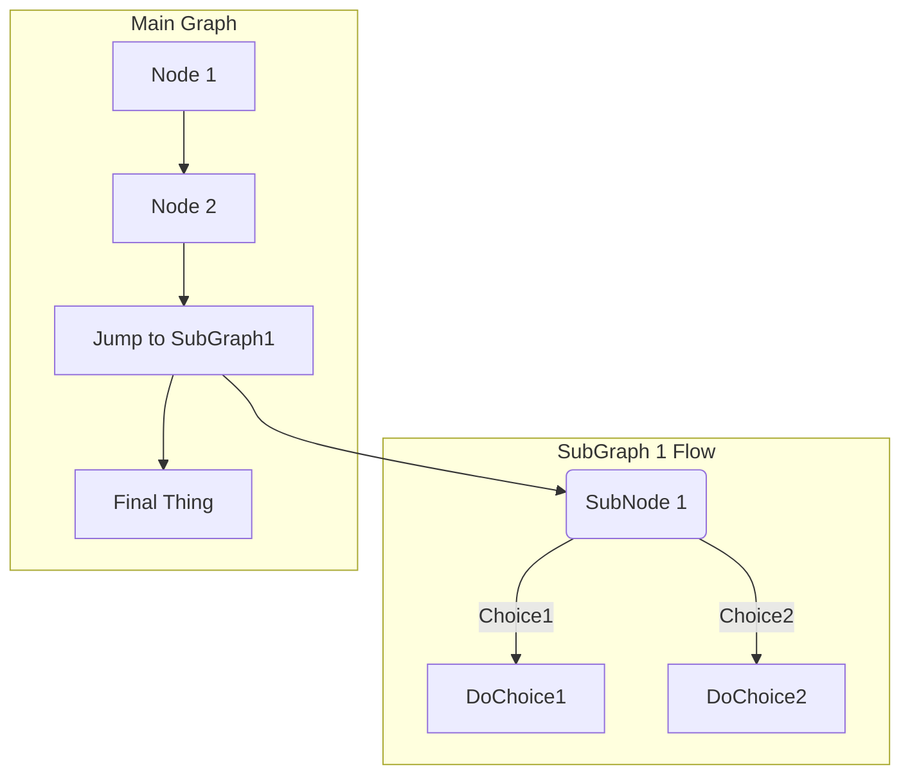

## 前言

GitLab Issue 作为 GitLab 项目协同管理和沟通交流的主要功能，其本身功能会直接影响工作效率。除了项目管理所需的各种 labels、weight、health、assign 等功能，一个美观方便的 Issue 内容也是十分重要的。本文会介绍一些美化 Issue 内容的方法，让 Issue 好看且实用。

## 被低估的 Markdown

Markdown 的灵活度非常高，用户只需简单的操作就可配制出非常美观的内容。

### 添加进度条

在 Issue 中添加进度条是非常实用的一种功能，这里推荐使用 [progress-bar](https://github.com/fredericojordan/progress-bar)，可以通过简单的参数配置出一个美观的进度条，效果如下：

```markdown

```


### 自定义 Badge


在浏览开源项目 `README` 时，会看到各种各样好看的 Badge。这些 Badge 往往会展示该项目目前的一些状态，如构建结果、使用 License、代码覆盖率等，这些 Badge 只需一些简单的参数，就可以实现自定义。[shields.io](https://shields.io/) 提供了很多现成的 Badge 供用户使用，还支持自定义，根据自己的需要，用户可以定制 Badge。

```markdown

```


### 任务清单

在 GitLab Issue 或任何可以使用 Markdown 的输入框，都可以加入任务清单。当点击选项框完成该项任务后，Issue history 会记录该任务已完成。

```markdown
- [x] Completed task
- [ ] Incomplete task
  - [ ] Sub-task 1
  - [x] Sub-task 2
  - [ ] Sub-task 3

1. [x] Completed task
1. [ ] Incomplete task
   1. [ ] Sub-task 1
   1. [x] Sub-task 2
```


所有任务会以 `n of x tasks completed`  的形式显示在 Issue list 的 Issue 详细中。


### 快速编辑表格

除了 Markdown 表格的标准编辑方式以外，GitLab Issue 还可以从其他电子表格软件（例如 Microsoft Excel、Google Sheets 或 Apple Numbers）直接复制，不想用 Markdown 编辑表格的话，可以先在其他软件标记好，直接复制过来即可。


### 快速链接 GitLab 其他资源

之前分享 quick action 操作时也有提到过，只要在 Issue 或其他可以输入 Markdown 内容的输入框中输入关键字，就会自动提示相关资源，选中后会自动为其添加链接，具体内容可以参考下表。

| references                                                                  | input                         | cross-project reference                 | shortcut inside same namespace |
|:----------------------------------------------------------------------------|:------------------------------|:----------------------------------------|:-------------------------------|
| specific user                                                               | `@user_name`                  |                                         |                                |
| specific group                                                              | `@group_name`                 |                                         |                                |
| entire team                                                                 | `@all`                        |                                         |                                |
| project                                                                     | `namespace/project>`          |                                         |                                |
| issue                                                                       | ``#123``                      | `namespace/project#123`                 | `project#123`                  |
| merge request                                                               | `!123`                        | `namespace/project!123`                 | `project!123`                  |
| snippet                                                                     | `$123`                        | `namespace/project$123`                 | `project$123`                  |
| epic                                               | `&123`                        | `group1/subgroup&123`                   |                                |
| vulnerability | `[vulnerability:123]`         | `[vulnerability:namespace/project/123]` | `[vulnerability:project/123]`  |
| feature flag                                                                | `[feature_flag:123]`          | `[feature_flag:namespace/project/123]`  | `[feature_flag:project/123]`   |
| label by ID                                                                 | `~123`                        | `namespace/project~123`                 | `project~123`                  |
| one-word label by name                                                      | `~bug`                        | `namespace/project~bug`                 | `project~bug`                  |
| multi-word label by name                                                    | `~"feature request"`          | `namespace/project~"feature request"`   | `project~"feature request"`    |
| scoped label by name                                                        | `~"priority::high"`           | `namespace/project~"priority::high"`    | `project~"priority::high"`     |
| project milestone by ID                                                     | `%123`                        | `namespace/project%123`                 | `project%123`                  |
| one-word milestone by name                                                  | `%v1.23`                      | `namespace/project%v1.23`               | `project%v1.23`                |
| multi-word milestone by name                                                | `%"release candidate"`        | `namespace/project%"release candidate"` | `project%"release candidate"`  |
| specific commit                                                             | `9ba12248`                    | `namespace/project@9ba12248`            | `project@9ba12248`             |
| commit range comparison                                                     | `9ba12248...b19a04f5`         | `namespace/project@9ba12248...b19a04f5` | `project@9ba12248...b19a04f5`  |
| repository file references                                                  | `[README](doc/README.md)`     |                                         |                                |
| repository file line references                                             | `[README](doc/README.md#L13)` |                                         |                                |
| alert                     | `^alert#123`                  | `namespace/project^alert#123`           | `project^alert#123`            |
| contact                                                                     | `[contact:test@example.com]`  |                                         |                                |

### 绘制流程图

GitLab Issue 支持使用 [Mermaid](https://mermaidjs.github.io/) 、[PlantUML](https://plantuml.com) 和 [Kroki](https://kroki.io) 来绘制流程图，其中 PlantUML 和 Kroki 都需要管理员开启集成功能，而 Mermaid 是默认开启的。

````markdown

````


GitLab Markdown 还支持很多有趣的功能，这里就不一一列举了，有兴趣的朋友可以在[官方文档](https://jihulab.com/help/user/markdown)找到详细内容。

## 巧用 emoji

除了在可以输入 Markdown 的部分可以用 emoji 以外，Issue 的标题也可以展示 emoji，不过目前只有 Issue 详情中可以展示 emoji，Issue List 中还无法展示。这里推荐一个快速查找 emoji 的网站：[emoji-cheat-sheet](https://www.webfx.com/tools/emoji-cheat-sheet/)，进入网站点击相应的 emoji 就可以复制其代码，在 GitLab Issue 中黏贴即可。


## 结语

Markdown 是一套非常开放和自由轻量级文本编辑语言，其赋予的 GitLab Issue 非常灵活多样的展示元素，同时 GitLab 还针对 Markdown 开发了多种方便且实用的功能来让协同和交流更加的高效。
